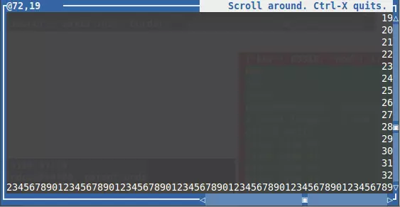
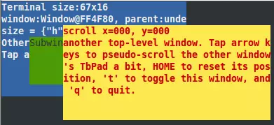
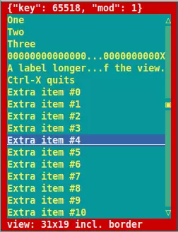

# s2 termbox
#### ([&#x2b11;Main Module Docs](../))
# termbox Terminal UI Module

- Source code: [](/dir/s2/mod/termbox?ci=trunk)

The termbox module binds the [termbox terminal UI
API](https://github.com/nsf/termbox) to s2. It is demonstrated in
several scripts in the source directory (see the link above).

While termbox provides a sane alternative to (n)curses, and has only a
dozen functions, it uses a fairly low-level approach to drawing, and
requires *lots* of add-on code if one wants to support windows, buttons,
text input, and other higher-level features. termbox provides a solid,
easy-to-use basis, but the lack of a set of higher-level widgets and
string input limits its usefulness for many apps. (That said, its
API/model is perfect for building such features upon, it just doesn't
provide any out of the box.)

Note that, like curses, termbox operates in a sort of batch mode. That
is, no changes become visible until the client tells the screen to
refresh. In termbox that is done using `tb_present()` resp. the `present()`
method provided by this module. Unlike curses, termbox always refreshes
the whole screen, whereas curses only updates modified cells, but on a
local machine a human eye cannot see the difference between both
approaches. (Curses was designed to be as over-the-wire efficient as
possible, as 2400 baud was *fast* at the time.)

Sidebar: as a point of reference, binding the core termbox API to s2
took about two hours, which also included learning the termbox API
(about which i had only learned about a few hours before). The point
being, it wasn't difficult to do, and it's just as easy to bind many
types of C APIs to cwal/s2. Since then, more work has gone into
developing a basic OO windowing API on top of it, but that work is as
yet experimental and not documented.


# Disclaimer & Disclosure

This module was one of the very first 3rd-party libraries to be bound
to s2, and has occassionally seen spurts of development, but, because
of termbox's complete lack of high(er)-level input features (e.g. no
text-entry fields), development has essentially ceased. Termbox is an
interesting library, but the types of apps it can be used for as-is is
*extremely limited* by its *complete* lack of out-of-the-box widgets.
That said, for apps which can get by just fine with one-key-at-a-time
interfaces, e.g. F-keys to activate individual features, it's really
a *huge* step up from working with the appropriately-named *curses*
APIs.

Apparently termbox has been effectively abandoned, but there are numerous
forks. Some seemingly promising forks are:

- <https://github.com/cylgom/termbox_next>
- <https://github.com/MorganPeterson/termbox_next>

"Maybe someday" we'll look at updating to one of those.

# Pics or it Didn't Happen!

A few screenshots of test apps:






# Color, Attribute, and Key Mappings

Colors and attributes are found in the module's `color` resp. `attr`
properties:

1.  `attr` keys: `bold`, `default`, `reverse`, `underline`. These are intended to
    be bitmasked together with a color code.

2.  `color` keys: `black`, `blue`, `cyan`, `default`, `green`, `magenta`, `red`, `white`,
    `yellow`

The C-level `TB_KEY_XXX` constants are mapped to the keys Hash (not
Object!). It is a hash because it contains quite a few entries and will
presumably be needed often for key dispatching (Object lookup speed is
much slower for long property lists). The names of the hash keys differ
notably from their native constant names, largely for usability and
conventions (e.g. `TB_KEY_CTRL_UNDERSCORE` is named `"^_"`. To get the
whole list of mappings, call thisModule.keys.entryKeys() and output it
(e.g. using `print()`) when not in TB screen mode. The hash contains two
sets of mappings: string-to-integer and integer-to-string. However, some
of the integer codes are duplicates, meaning that the integer-to-string
mappings do not contain all entries (only one of the entries colliding
with it, but which one is unspecified). The integer values in the hash
table correspond to key codes set on Event objects. e.g. if poll()
returns an object with key=17, this hash will tell us that that key
combo is called `"^Q"` (and, conversely, the reverse mapping will tell us
that `"^Q"` maps to 17). In addition to the termbox-defined mappings, it
also maps the key codes for the ASCII characters 'a' to 'z', 'A' to 'Z',
and '0' (zero) to '9', including reverse mappings.


# termbox Methods

Most of the following methods correspond directly to [C functions in the
termbox API](https://github.com/nsf/termbox/blob/master/src/termbox.h),
with only minor changes made to semantics. The rest are convenience
wrappers built atop those.

```s2-member
Object change(int x, int y, char ch, int fg, int bg)
```

Modifies the contents of the given screen cell. The ch parameter may
be either an integer (UTF-8 code point) or a string, in which case its
first character is used. fg and bg are the foreground and background
attributes, respectively (see the attr and color properties, described
above). Throws if (x,y) is out of range. Returns this object.


```s2-member
Object clear([fg = 0, bg = 0])
````
Clears the screen, optionally using the given foreground/background
attributes (if one is provided, both must be). Returns this object.


```s2-member
Object cursor([x = -1, y = -1])
```
Enables display of the cursor at the given screen position, or turns
the cursor off if x or (and?) y are negative. Returns this object.

```s2-member
int height([bool initScreenMode=false])
```

Returns the terminal window's height in screen cells. Both dimensions
have negative values if not in termbox screen mode. If passed a truthy
value, it initializes the screen state if needed.

```s2-member
Object init()
```

Runs `tb_init()` if it has not already been called by this
API. Multiple calls to it while it is active are harmless no-ops (the
second and subsequent calls are ignored until `shutdown()` is
called). Returns this object.


```s2-member
int inputMode([int = inputMode.current])
```

Analog to `tb_select_input_mode()`. The argument may be one of:
`inputMode['current' or 'alt' or 'esc']`.

```s2-member
int outputMode([int = ouputMode.current])
```

Analog to `tb_select_output_mode()`. The argument may be one of
`outputMode['grayscale' or 'normal' or 'current' or 216 or 256]` (note
that the last two are integers, not strings!).

```s2-member
mixed peek([int milliseconds = someArbitraryShortDefault])
```

Similar to `poll()`, but times out and returns undefined after the given
number of milliseconds if no event arrives. If an event arrives in
time, it is returned as described for `poll()`.


```s2-member
Object poll()
```

Waits for an event (keypress or window resize) and returns it in the
form of an object. Its structure matches that of the C-level `tb_event`
type, except that there is no type property and only properties
relevant to the specific event type are set (which is why we don't
need a type field).

```s2-member
Object present()
```
Flushes all pending modifications to the screen, making them visible
to the user. Returns this object.

```s2-member
Object print3(int x, int y, ...values)
```
Works just like `print5()` (see below) but uses the termbox defaults for
foreground/background attributes.


```s2-member
Object print5(int x, int y, int fg, int bg, ...values)
```

Prints one or more values to the given position using the given
attributes. If more than one value is provided, they are appended. It
respects newline characters and will wrap lines at the right edge of
the screen, but will stop at the end (bottom/right) of the screen (as
termbox has no built-in scrolling support). Returns this object.
Passing negative values for the 3rd and 4th parameters will use
whatever the unspecified defaults are.

```s2-member
void shutdown()
```

Shuts down the screen mode, restoring it to a pre-init() state. This
is a no-op if `init()` has not been called. It is possible to initialize
and shutdown multiple times within a single session. Tip: if the screen
gets messed up after exiting the script because this did not get
called, one can type "reset" in most shells to restore the terminal to
a usable state.

```s2-member
Object size()
```

Returns an object in this form: `{w: this.width(), h: this.height()}`

```s2-member
int width([bool initScreenMode=false])
```

Returns the terminal's width in screen cells. Both dimensions have
negative values if not in termbox screen mode. If passed a truthy
value, it initializes the screen state if needed.
